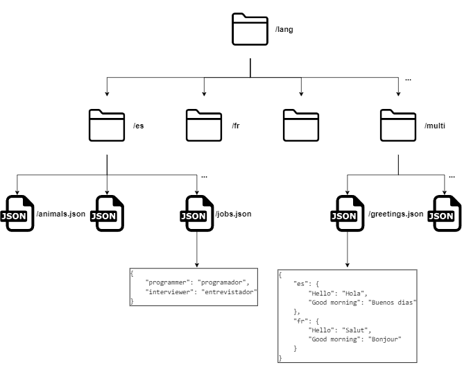

# PHP JSON tongue

[](https://packagist.org/packages/elaborate-code/php-json-tongue)

[](https://github.com/elaborate-code/php-json-tongue/actions/workflows/run-tests.yml)

[](https://github.com/elaborate-code/php-json-tongue/actions/workflows/fix-php-code-style-issues.yml)


<!-- [](https://github.com/elaborate-code/php-json-tongue/actions/workflows/run-tests.yml) -->
<!-- [](https://github.com/elaborate-code/php-json-tongue/actions/workflows/fix-php-code-style-issues.yml) -->

A Façade for loading localization data from a folder tree of JSON files.

## Get started

Install the package with composer:

```text
composer require elaborate-code/php-json-tongue
```

Requirements:

-   PHP 8.0 or higher

## Usage

Set the file structure.



Then use the facade.

```php
use ElaborateCode\JsonTongue\TongueFacade;

$tongue = new TongueFacade('/lang');

$localization = $tongue->transcribe();
```

`$localization` will be set like:

```php
$localization = [
    "es" => [
        "programmer" => "programador",
        "interviewer" => "entrevistador",
        "Hello" => "Hola",
        "Good morning" => "buenos dias",
        //...
    ],
    "fr" => [
        "Hello" => "Salut",
        "Good morning" => "Bonjour",
        //...
    ]
    //...
];
```

## Testing

```bash
vendor/bin/pest
```

### JSON Faker

Just like when testing Laravel apps, we populate the database temporarily and use the `RefreshDatabase` trait to rollback the database to its fresh state.

This package ships with `ElaborateCode\JsonTongue\JsonFaker\JsonFaker` class that helps create a temporary tree of **locale folders** and **JSON files** filled with translations.

Here is an example:

```php
$json_faker = JsonFaker::make()
    ->addLocale('ar', [
        'ar.json' => [],
    ])
    ->addLocale('en', [
        'en.json' => [
            'en' => 'en',
            "I know. They're both good. It's hard to decide. McCain is older but he has more experience. Obama seems to have a lot of good ideas, but some people say he wants to raise taxes." => 'Lo sé. Ambos son buenos. Es difícil decidir. McCain es mayor pero tiene más experiencia. Obama parece tener muchas buenas ideas, pero algunas personas dicen que quiere aumentar los impuestos.',
        ],
        'one.json' => [
            'one' => 'one',
        ],
        'two.json' => [
            'two' => 'two',
        ],
    ])
    ->addLocale('multi', [
        'greetings.json' => [
            'en' => [
                'Hello' => 'Hello',
            ],
            'fr' => [
                'Hello' => 'Salut',
            ],
        ],
    ])
    ->write();

// Assert

$json_faker->rollback(); // Delete the complete file structure created for the test
```

> This class can help make tests when contributing on this package or when using this package.

## Changelog

<!-- Please see [CHANGELOG](CHANGELOG.md) for more information on what has changed recently. -->

## Contributing

Please see [CONTRIBUTING](CONTRIBUTING.md) for details.

## License

The MIT License (MIT). Please see [License File](LICENSE.md) for more information.
