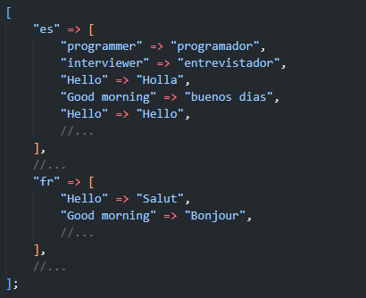

# PHP JSON tongue


[](https://github.com/elaborate-code/php-json-tongue/actions/workflows/run-tests.yml)
[](https://github.com/elaborate-code/php-json-tongue/actions/workflows/fix-php-code-style-issues.yml)


A Facade for loading localization data from JSONs within a lang folder

## Get started

```text
composer require elaborate-code/php-json-tongue
```

## Usage

Set the file structure.


Then use the facade.

```php
use ElaborateCode\JsonTongue\TongueFacade;

$tongue = new TongueFacade('/lang');

$localization = $tongue->transcribe();
```

`$localization` will look like:



